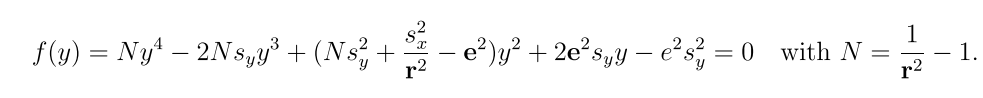

ROpenSfM 
=======


## Overview
ROpenSfM is a Structure from Motion library that can handle refraction. It is based on [OpenSfM library](https://github.com/mapillary/OpenSfM). 


## Building

[instructions](https://opensfm.org/docs/building.html)


## Geometry

- [opensfm geometry](https://www.opensfm.org/docs/geometry.html)

Camera coordinate system: 
- x-axis: right
- y-axis: down
- z-axis: front

Camera up vector: WCS up vector in the CCS. Example:

``` Camera Facing Down: up_vector = [0, 0, -1]```


IMS Data Gimbal yaw angle:
Clockwise measured angle between WCS `y` and CCS `-y` axis. 

ROpenSFM `camera_compass_angle` function:
Angle between world's y-axis and camera's z-axis projected onto the xy-world plane.

## Exif

Using gimbal for camera rotation extraction from exif xmp:
 `@drone-dji:GimbalYawDegree`
 `@drone-dji:GimbalPitchDegree`
 `@drone-dji:GimbalRollDegree`
 
 For reconstruction we assume zero pitch/roll and we use gimbal yaw to calculate camera orientation.


## Refraction

Refraction takes place in a 2D plane. Calculation of `ry` 




## Reconstruction Code

### Incremental Reconstruction
- ```incremental_reconstruction``` function [code](opensfm/reconstruction.py#L1092).
  For each pair:
  - Step 1: ```bootstrap_reconstruction``` [code](opensfm/reconstruction.py#L423)
    - ```two_view_reconstruction_general```:
      - 5-points 
      - plane based  
    - ```triangulate_shot_features```
    - ```bundle_single_view```: gets pose of a shot.
  - Step 2: ```grow_reconstruction``` [code](opensfm/reconstruction.py#L988) Grows a bootstraped reconstruction using bundle adjustment.
    ```align_reconstruction(reconstruction, gcp, config)
       bundle(reconstruction, camera_priors, None, config)
       remove_outliers(reconstruction, config)
       for each candidate_image:
         bundle_single_view
         triangulate_shot_features
     ```
### Bundle
 Entrypoint function [code](opensfm/src/map/src/ba_helpers.cc#L314)
 
 #### bundle_adjuster.cc
 
 - Adding projection error to the optimization [code](opensfm/src/bundle/src/bundle_adjuster.cc#L434).
 
 #### projection_errors.h
 -  ```ReprojectionError2D```: 2D reprojection error implementation [code](opensfm/src/bundle/src/projection_errors.h#L110)
 
 
     
    


